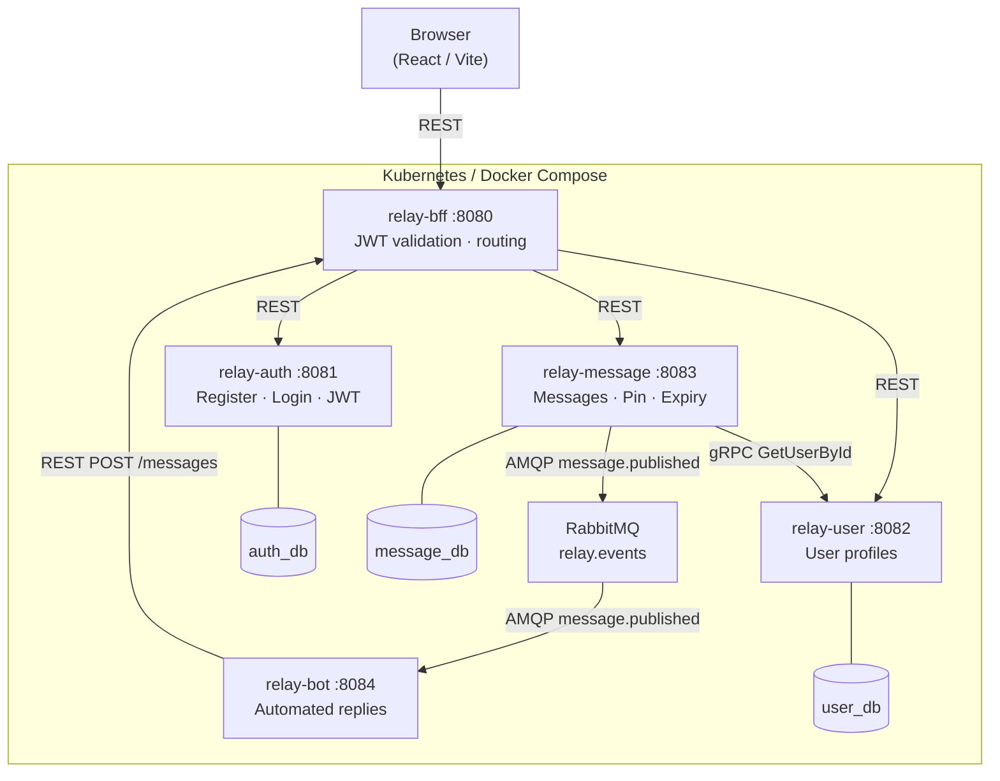

# Relay Platform

> Relay is a distributed real-time chat platform built as a microservices system on Java 25 and Spring Boot 4. Users can send messages to a shared channel, pin important messages to keep them permanently visible, and receive automated replies from a bot — all routed through a single BFF that validates JWT tokens before any internal service is reached.

[](https://github.com/viktorlindell12/relay-platform/actions/workflows/ci.yml)

---

## Architecture



---

## Tech Stack

| Service                | Language   | Framework       | Database   | Notes                         |
|------------------------|------------|-----------------|------------|-------------------------------|
| relay-bff-service      | Java 25    | Spring Boot 4.0 | —          | JWT filter, WebClient routing |
| relay-auth-service     | Java 25    | Spring Boot 4.0 | PostgreSQL | JJWT 0.12                     |
| relay-user-service     | Java 25    | Spring Boot 4.0 | PostgreSQL | gRPC server (port 9090)       |
| relay-message-service  | Java 25    | Spring Boot 4.0 | PostgreSQL | Flyway migrations, scheduler  |
| relay-bot-service      | Java 25    | Spring Boot 4.0 | —          | RabbitMQ consumer             |
| relay-frontend         | TypeScript | React + Vite    | —          | Nginx (non-root, port 8080)   |

**Message queue:** RabbitMQ &nbsp;·&nbsp; **Internal RPC:** gRPC (Message → User) &nbsp;·&nbsp; **Auth:** JWT validated in BFF

---

## Services

| Service              | Responsibility |
|----------------------|----------------|
| **relay-bff**        | Single public entry point. Validates the JWT on every request and proxies to the correct internal service. Internal services are not reachable from outside the cluster. |
| **relay-auth**       | Handles registration and login. Issues signed JWTs on successful login. |
| **relay-user**       | Stores user profiles (username, display name). Exposes `GetUserById` over gRPC so other services can resolve display names without an HTTP round-trip. |
| **relay-message**    | Stores messages in PostgreSQL. Unpinned messages expire after 24 h; pinned messages are kept indefinitely. Publishes a `message.published` event to RabbitMQ after each commit. |
| **relay-bot**        | Listens for `message.published` events and posts an automated reply through the BFF. |

---

## Event Flow — `message.published`

```text
1. Client  →  POST /api/messages  →  BFF (JWT validated)
2. BFF     →  POST /messages      →  relay-message-service
3. relay-message-service saves message to message_db
4. After DB commit: publishes { id, senderId, channel, content }
   to RabbitMQ exchange "relay.events", routing key "message.published"
5. relay-bot-service consumes the event from queue "bot.message-published"
6. relay-bot-service POSTs a reply back through the BFF
```

The event is published **after** the database transaction commits, so the bot never receives an event for a message that was rolled back.

---

## Getting Started

### Prerequisites

- Docker + Docker Compose
- Java 25 + Maven (local dev only)
- Node.js 22+ (local dev only)

### Run with Docker Compose

```bash
cp .env.example .env   # fill in JWT_SECRET and INTERNAL_API_KEY
docker-compose up
```

| Endpoint            | URL                                        |
|---------------------|--------------------------------------------|
| Frontend            | http://localhost                           |
| API (BFF)           | http://localhost:8080                      |
| Swagger UI          | http://localhost:8080/swagger-ui.html      |
| RabbitMQ Management | http://localhost:15672 &nbsp;(guest/guest) |

### Run with Kubernetes (Minikube)

**1. Start Minikube**
```bash
minikube start
```

**2. Point Docker to Minikube's daemon**
```bash
eval $(minikube docker-env)
```

**3. Build all images**
```bash
docker build -f relay-auth-service/Dockerfile    -t relay-auth-service:latest    .
docker build -f relay-user-service/Dockerfile    -t relay-user-service:latest    .
docker build -f relay-message-service/Dockerfile -t relay-message-service:latest .
docker build -f relay-bff-service/Dockerfile     -t relay-bff-service:latest     .
docker build -f relay-bot-service/Dockerfile     -t relay-bot-service:latest     .
docker build -f relay-frontend/Dockerfile        -t relay-frontend:latest        .
```

**4. Create namespace and apply secrets**
```bash
kubectl create namespace relay

# Generate and apply secrets directly — never commit real values
kubectl create secret generic relay-app-secrets \
  --from-literal=jwt-secret=$(openssl rand -hex 32) \
  --from-literal=internal-api-key=$(openssl rand -hex 32) \
  --namespace=relay

kubectl apply -f k8s/secrets.yaml -n relay   # postgres + rabbitmq credentials
```

**5. Deploy infrastructure, then services**
```bash
kubectl apply -f k8s/postgres/ -n relay
kubectl apply -f k8s/rabbitmq/ -n relay
kubectl wait --for=condition=ready pod -l app=postgres -n relay --timeout=120s
kubectl wait --for=condition=ready pod -l app=rabbitmq -n relay --timeout=120s

kubectl apply -f k8s/auth-service/    -n relay
kubectl apply -f k8s/user-service/    -n relay
kubectl apply -f k8s/message-service/ -n relay
kubectl apply -f k8s/bff-service/     -n relay
kubectl apply -f k8s/bot-service/     -n relay
kubectl apply -f k8s/frontend/        -n relay
```

**6. Expose LoadBalancer services (keep this terminal open)**
```bash
minikube tunnel
```

**7. Open the app**
```bash
kubectl get service relay-frontend -n relay
# Copy EXTERNAL-IP and open in browser
```

---

## Screenshots

| Login | Chat |
|-------|------|
|  |  |

---

## API Reference

| Method | Path                     | Auth     | Description              |
|--------|--------------------------|----------|--------------------------|
| POST   | /api/auth/register       | Public   | Register a new user      |
| POST   | /api/auth/login          | Public   | Login, returns JWT       |
| GET    | /api/users/{id}          | Required | Get user profile         |
| POST   | /api/messages            | Required | Send a message           |
| GET    | /api/messages?channel={channel} | Required | List active messages     |
| PATCH  | /api/messages/{id}/pin   | Required | Toggle pin on a message  |